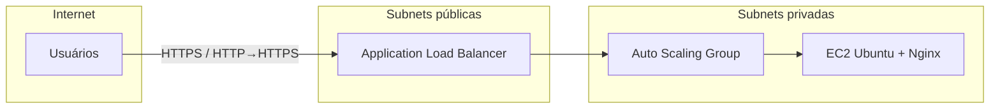

# Infraestrutura elástica na AWS com Terraform

**IaC** para ambiente de **alta disponibilidade** com **Application Load Balancer**, **Auto Scaling** e **EC2** (Nginx) em subnets privadas — organizado em **stacks**, **módulos reutilizáveis**, **state remoto no S3** e **CI/CD no GitHub Actions**.

*Projeto de portfólio focado em Cloud, DevOps e práticas próximas a ambientes corporativos.*

---

## Por que este projeto existe

Demonstrar na prática **como modelar, versionar e entregar infraestrutura** com Terraform na AWS: separação de responsabilidades, dependência entre stacks, HTTPS na borda, escalonamento automático e pipeline que **planeja em PR** e **aplica na `main`** — além de um fluxo manual para **destruir** o ambiente de estudo e **controlar custos**.

---

## O que este repositório evidencia (para recrutamento)

| Área | Competências |
|------|----------------|
| **IaC** | Terraform (módulos, `remote state`, variáveis, `default_tags`) |
| **AWS** | VPC, subnets públicas/privadas, IGW, NAT, ALB, ASG, ACM, Route 53, CloudWatch |
| **Rede** | Carga na borda pública; aplicação em subnets privadas sem IP público nas instâncias |
| **Segurança em camadas** | Security groups (ALB ↔ EC2), TLS (ACM), redirecionamento HTTP→HTTPS |
| **Operação** | State remoto (S3 + lock DynamoDB), GitHub Actions (plan / apply / destroy manual) |
| **FinOps (lab)** | Workflow opcional para desmontar stacks e evitar custo contínuo |

---

## Arquitetura (visão lógica)

Fluxo de tráfego: **Internet → ALB (público) → instâncias (privadas)**. O Auto Scaling ajusta a capacidade conforme política de CPU (Target Tracking).

---

## Organização do repositório

| Caminho | Função |
|---------|--------|
| `stacks/bootstrap` | Base para state remoto (S3, DynamoDB) e zona DNS no Route 53 (*normalmente aplicado manualmente no início do lab*) |
| `stacks/network` | VPC, subnets, IGW, NAT, rotas |
| `stacks/compute` | Security groups, ALB, ASG, EC2, certificado ACM e registros DNS para o app |
| `modules/` | Módulos reutilizáveis (VPC, ALB, ASG, security groups) |
| `.github/workflows/` | Pipelines Terraform |

**Ordem de dependência:** `bootstrap` (quando necessário) → **`network`** → **`compute`** (a stack compute consome *outputs* do state da network via `terraform_remote_state`).

---

## CI/CD (GitHub Actions)

| Workflow | Quando roda | O que faz |
|----------|----------------|-----------|
| **Terraform Plan** | Pull request para `main` (alterações em `stacks/**` ou `modules/**`) | `terraform fmt -check`, `validate` e `plan` nas stacks **network** e **compute** |
| **Terraform Apply** | Push em `main` (após merge) | `apply` em sequência: **network** → **compute** |
| **Terraform Destroy (lab)** | Manual (`workflow_dispatch`) | `destroy` em sequência: **compute** → **network** (com confirmação `DESTROY`) |

**Secrets necessários no repositório:** `AWS_ACCESS_KEY_ID` e `AWS_SECRET_ACCESS_KEY` (credenciais IAM com permissões compatíveis com o que o Terraform gerencia).

> **Nota:** O primeiro `plan`/`apply` da stack **compute** exige que o state da **network** no S3 já contenha *outputs* (VPC e subnets). Se a network ainda não foi aplicada, planeje aplicar **network** antes.

---

## Stack de tecnologias

- **Terraform** (≥ 1.9)
- **AWS:** VPC, EC2, ALB, Auto Scaling, CloudWatch, ACM, Route 53, S3, DynamoDB
- **SO / app:** Ubuntu, Nginx
- **CI:** GitHub Actions

---

## Como reproduzir (alto nível)

1. Clonar o repositório e configurar credenciais AWS na máquina ou na CI.
2. Ajustar variáveis usando os arquivos `terraform.tfvars.example` em cada stack (copiar para `terraform.tfvars` onde fizer sentido).
3. Subir **network** e depois **compute** (ou confiar no **Apply** da pipeline após merge, na ordem dos jobs).
4. O **bootstrap** trata do backend de state e da zona DNS; em labs costuma ser passo inicial e fora do fluxo automático de apply/destroy das stacks de app.

*(Detalhes de comandos `terraform init` / `apply` variam conforme backend e conta; use sempre `terraform plan` antes do `apply`.)*

---

## Sobre mim

**Fabio Henrique Shreiner** — foco em infraestrutura, cloud e DevOps.

Monte Azul Paulista – SP, Brasil · [LinkedIn](https://www.linkedin.com/in/fabio-shreiner) · fshreiner21@gmail.com

---

## Licença e uso

Código disponível para estudo e referência de portfólio. Infraestrutura em nuvem gera **custo**; use destroy/limpeza ao final dos testes.
